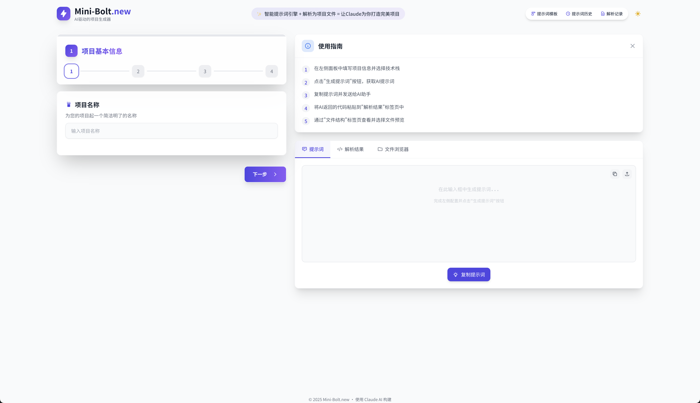
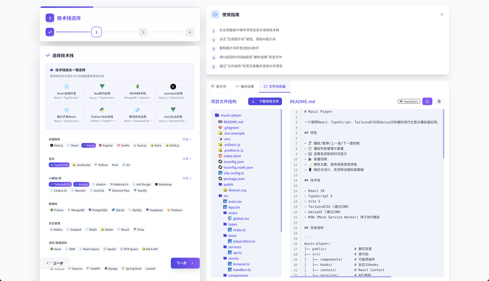

# Mini-Bolt.new ⚡



## 📖 项目介绍

Mini-Bolt.new 是由一个 Mini-Bolt.new(v1)生成的智能提示词引擎和项目文件解析工具，让 Claude 为您打造完美项目，一键导出即可运行！通过简单直观的界面，您可以轻松创建、管理和导出由 AI 生成的项目。

### 🌟 核心功能

- ✨ **智能提示词生成**：根据项目需求和技术栈生成优化的提示词
- 📁 **代码解析与导出**：自动解析 AI 返回的代码并构建完整项目结构
- 💾 **模板管理系统**：保存和复用常用提示词模板
- 📚 **历史记录追踪**：保存生成的提示词和解析的项目
- 🔍 **Markdown 预览**：内置 Markdown 渲染功能
- 🎨 **深色/浅色主题**：支持多种主题模式

## 📸 界面展示

### 主界面



## 🛠️ 技术栈

- **前端框架**：Vue.js 3 (组合式 API)
- **状态管理**：Pinia
- **路由系统**：Vue Router
- **UI 框架**：TailwindCSS + daisyUI
- **工具库**：
  - marked.js (Markdown 解析)
  - JSZip (文件打包与下载)

## 🚀 安装与使用

### 环境要求

- Node.js 16+
- npm 7+ 或 yarn 1.22+ 或 pnpm 7+

### 安装依赖

```bash
# 使用 npm
npm install

# 或使用 yarn
yarn install

# 或使用 pnpm
pnpm install
```

### 开发模式

```bash
# 使用 npm
npm run dev

# 或使用 yarn
yarn dev

# 或使用 pnpm
pnpm dev
```

### 构建生产版本

```bash
# 使用 npm
npm run build

# 或使用 yarn
yarn build

# 或使用 pnpm
pnpm build
```

## 📂 项目结构

```
Mini-Bolt.new/
├── public/               # 静态资源
├── src/
│   ├── assets/           # 静态资源文件
│   ├── components/       # 可复用组件
│   ├── composables/      # 组合式函数
│   ├── router/           # 路由配置
│   ├── stores/           # Pinia 状态管理
│   ├── views/            # 页面视图
│   ├── App.vue           # 根组件
│   └── main.js           # 入口文件
├── img/                  # 项目截图和图片
├── index.html            # HTML 模板
├── package.json          # 项目依赖
├── tailwind.config.js    # Tailwind 配置
└── vite.config.js        # Vite 配置
```

## 📝 功能使用说明

1. **项目需求输入**：在左侧面板填写项目名称、技术栈和需求描述
2. **生成提示词**：点击生成按钮获取优化的 AI 提示词
3. **解析 AI 回复**：将 AI 返回的代码粘贴到解析面板进行处理
4. **查看项目结构**：在文件结构面板浏览解析出的项目文件
5. **下载项目**：点击下载按钮将完整项目打包为 ZIP 文件

## 🧩 开发者说明

### 扩展技术栈

修改 `src/constants/techStack.js` 文件添加新的技术栈选项。

### 自定义模板

通过模板管理界面添加和编辑提示词模板，支持变量替换功能。

### 主题定制

项目使用 TailwindCSS 进行样式管理，可在 `tailwind.config.js` 中自定义主题颜色。

## 📄 许可证

MIT
